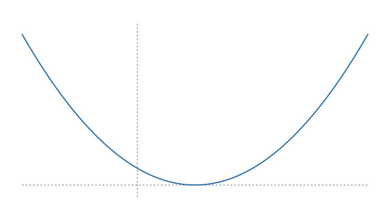

# A quadratic report

This ordinary Markdown note is the source of the report. It has normal KaTeX,
such as $f(x) = x^2 - 2x + 1 = (x - 1)^2$, and computed prose.


## Computed results

The exact vertex is (1, 0).

| x | f(x) |
| --- | --- |
| -1 | 4 |
| 0 | 1 |
| 1 | 0 |
| 2 | 1 |
| 3 | 4 |

*Selected values of the quadratic*



*Plot of the quadratic*

```text
1 │ 1  -2   1
  │     1  -1
  -----------
  │ 1  -1   0
```

*Synthetic division by x - 1*


The report object is omitted from the authored page, but `static:{report}`
places its structured result here when exporting. Tables remain Markdown tables,
the plot is saved as SVG under `assets/rix`, and the synthetic-division layout
is retained as a presentation block.
