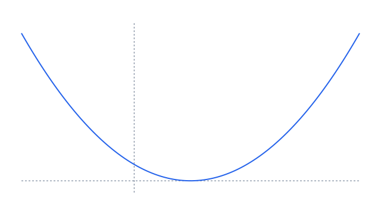

# Quadratic slides

This note demonstrates an export-only RiX slide deck. Its Quarto export uses
Reveal.js automatically; static Markdown and HTML retain the slide sections in
reading order.

---

## A quadratic in three views

# The polynomial

f(x) = (x - 1)^2 has an exact minimum at x = 1.

---

## Values

| x | f(x) |
| --- | --- |
| 0 | 1 |
| 1 | 0 |
| 2 | 1 |

*Selected exact values*

---

## Graph

*The graph of the quadratic*

